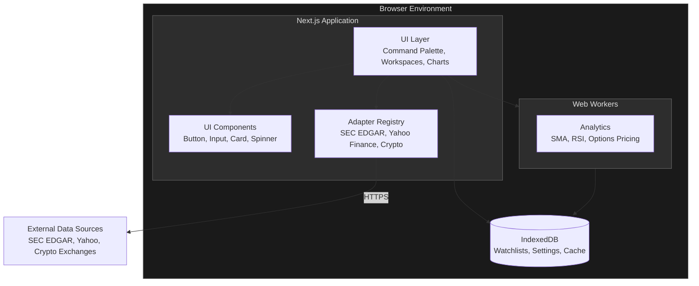
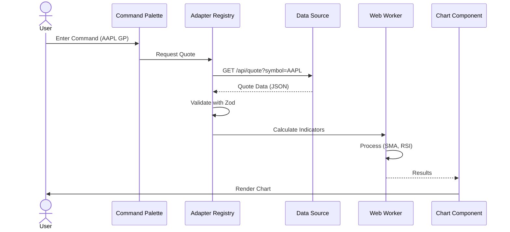
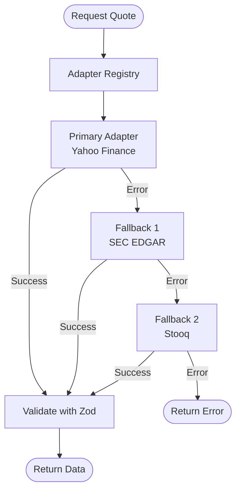
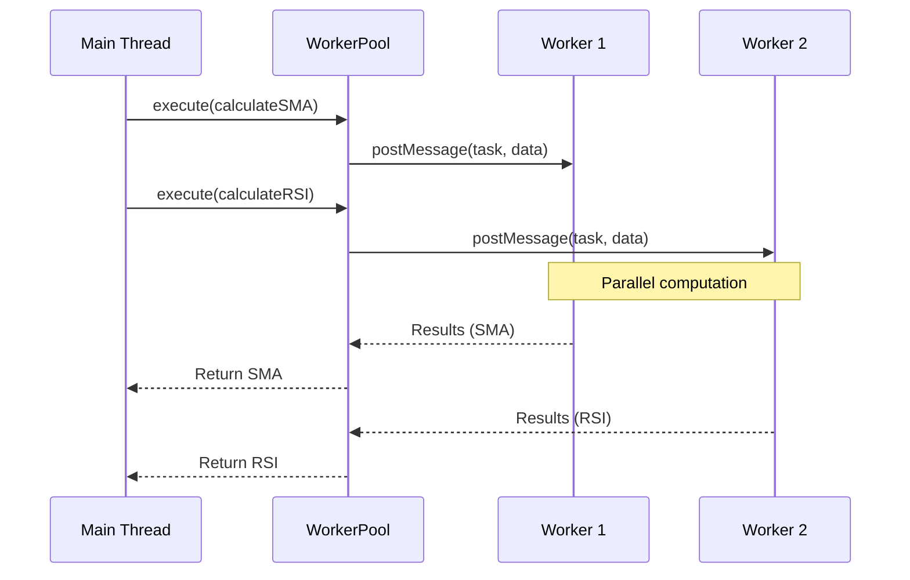
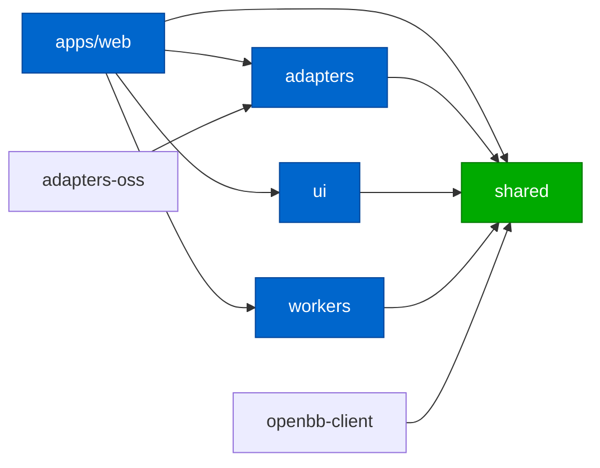
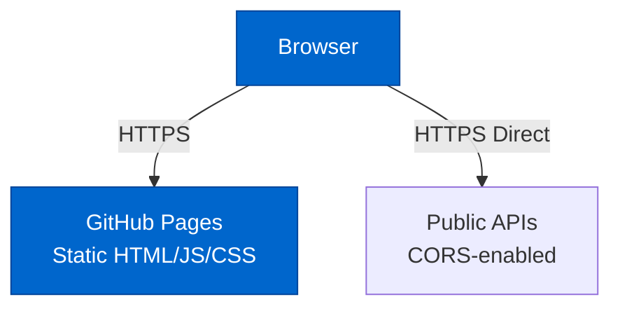
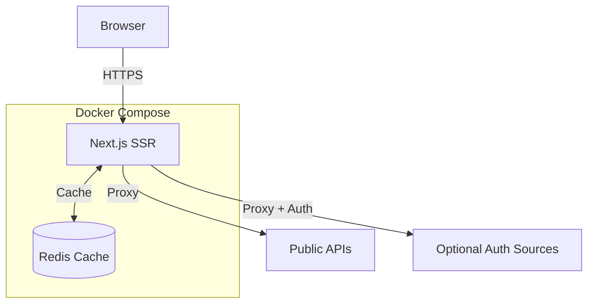
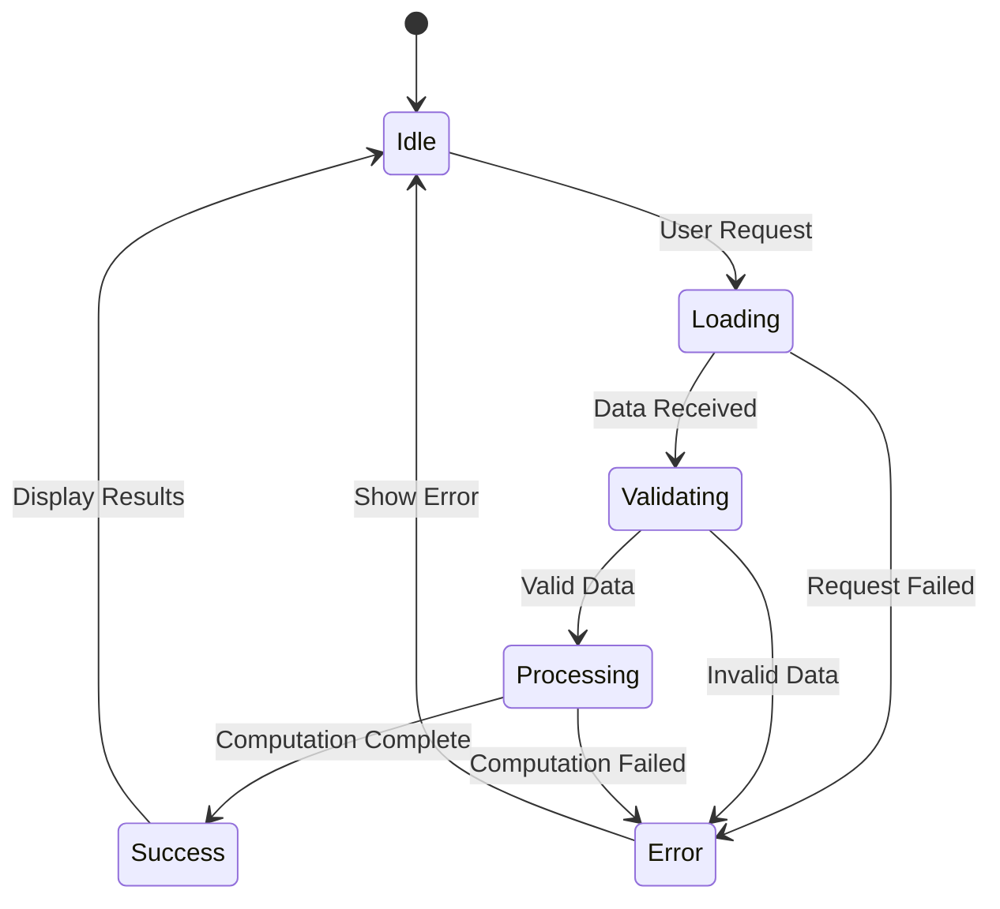

# Architecture Diagrams (Mermaid)

This file contains Mermaid diagrams for the Open Financial Terminal architecture.

## System Architecture Overview

## User Interaction Sequence

## Data Adapter Fallback Flow

## Worker Pool Architecture

## Package Dependencies

## Deployment Models

### Static Deployment (GitHub Pages)

### Self-Hosted Deployment

## Data Flow States

