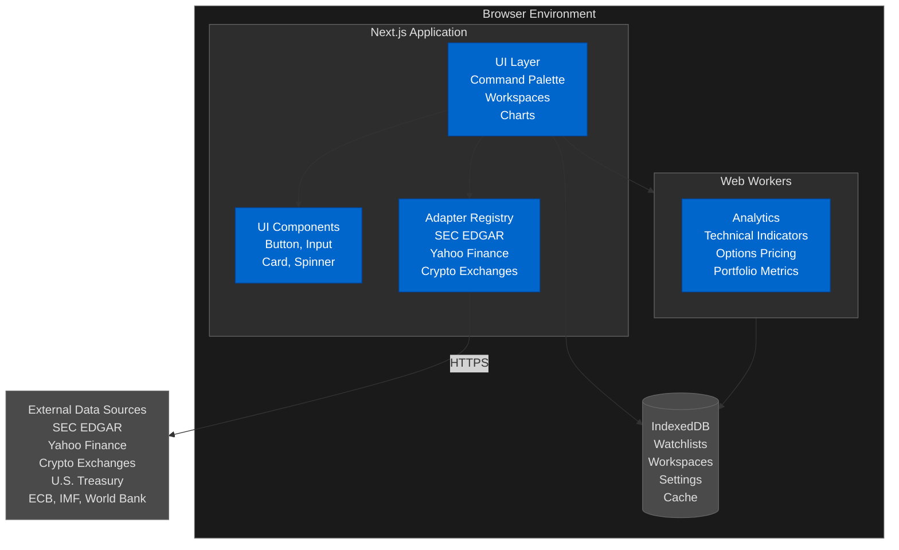
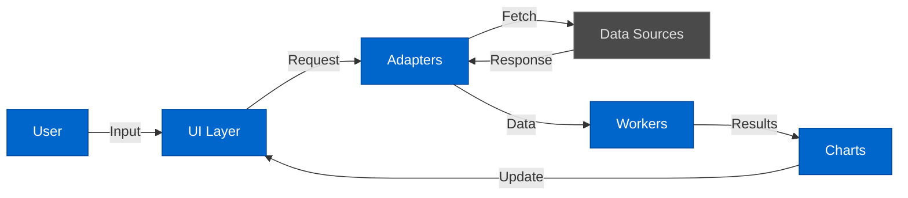
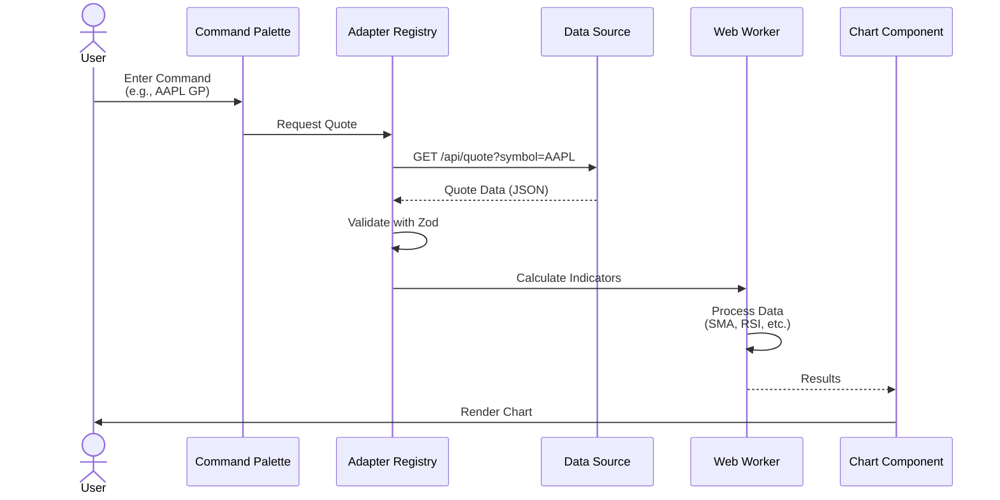
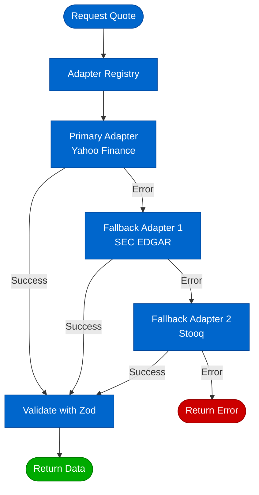
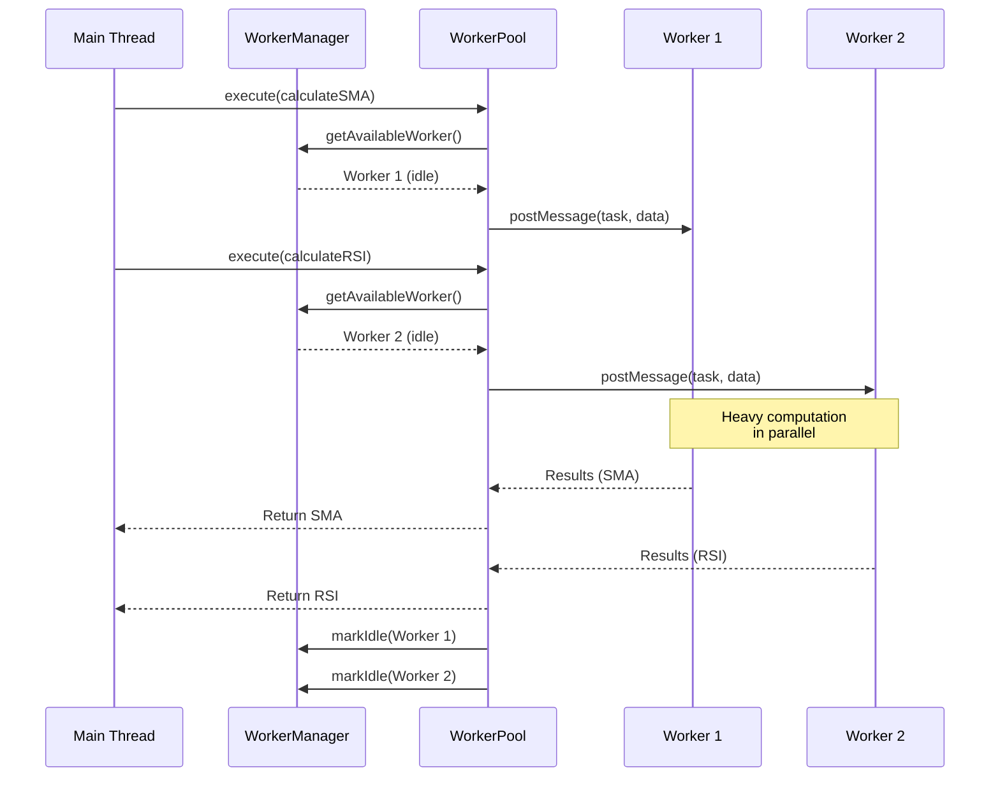
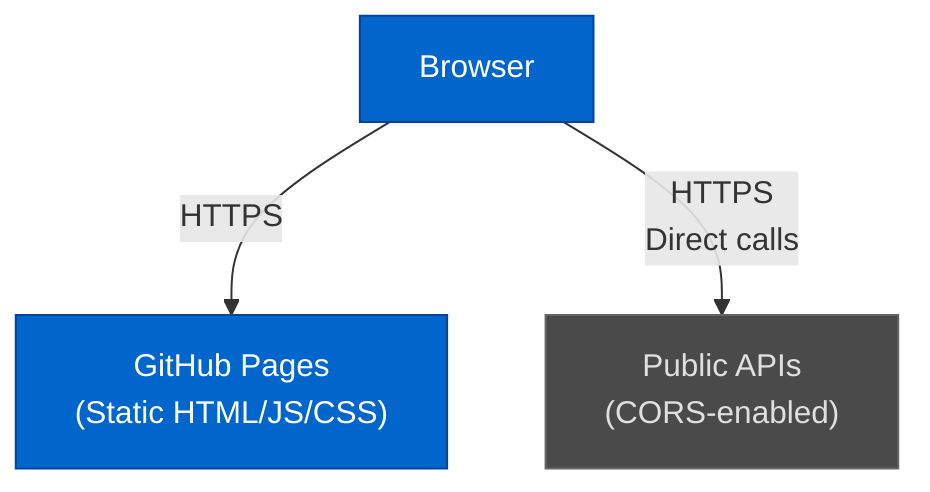
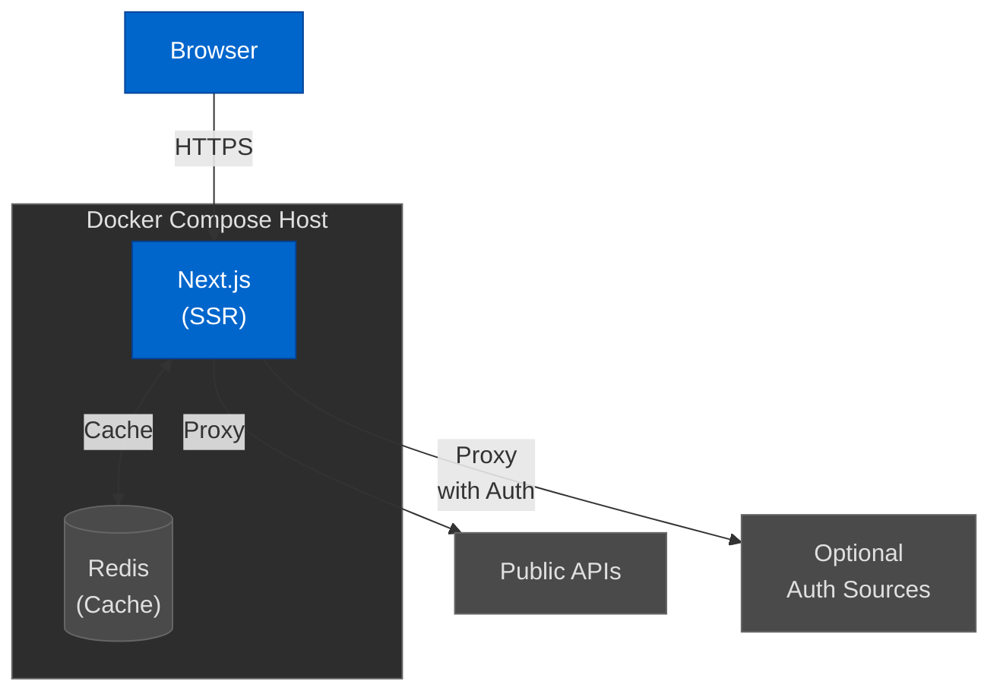

# Open Financial Terminal - Architecture

This document describes the system architecture, design principles, and technical implementation of the Open Financial Terminal.

## Table of Contents

- [Overview](#overview)
- [Design Principles](#design-principles)
- [System Architecture](#system-architecture)
- [Package Structure](#package-structure)
- [Data Flow](#data-flow)
- [Technology Stack](#technology-stack)
- [Deployment Models](#deployment-models)

## Overview

Open Financial Terminal is a web-based financial analysis platform approximating Bloomberg Terminal functionality using free, no-account-required data sources. The system is built as a TypeScript monorepo using modern web technologies with a focus on accessibility, performance, and extensibility.

### Key Goals

- **100% Free Data**: Default to free, public data sources
- **Open Source**: MIT licensed, community-driven
- **Bloomberg-Like UX**: Terminal-style interface with command palette
- **Extensible**: Plugin system for adapters and analytics
- **Accessible**: WCAG 2.1 AA compliant
- **Production-Grade**: TypeScript-first, comprehensive testing

## Design Principles

### 1. Separation of Concerns

- **Adapters**: Data source abstraction
- **Analytics**: Business logic in Web Workers
- **UI**: Presentation layer with React
- **Shared**: Common types and utilities

### 2. Type Safety

- Strict TypeScript everywhere
- Runtime validation with Zod at I/O boundaries
- No implicit any
- Discriminated unions for variants

### 3. Progressive Enhancement

- Core functionality works without optional features
- Graceful degradation for unsupported browsers
- Optional data sources enhance but don't block

### 4. Performance

- Heavy computation in Web Workers
- Lazy loading of components
- Efficient caching strategies
- Static site generation for fast initial load

### 5. Accessibility

- Keyboard-first navigation
- ARIA labels and roles
- Screen reader support
- High contrast themes

## System Architecture

### High-Level Architecture



### Component Interaction Flow



## Package Structure

### Monorepo Organization

```mermaid
graph TD
    Root["<b>open-fin-terminal/</b>"]
    
    Apps["<b>apps/</b>"]
    Web["web/<br/><i>Next.js App</i>"]
    Server["server/<br/><i>Optional Node.js</i>"]
    
    Packages["<b>packages/</b>"]
    Shared["shared/<br/><i>Types & Utils</i>"]
    Adapters["adapters/<br/><i>Interfaces</i>"]
    AdaptersOSS["adapters-oss/<br/><i>Free Adapters</i>"]
    AdaptersOpt["adapters-opt/<br/><i>Optional</i>"]
    OpenBB["openbb-client/<br/><i>OpenBB</i>"]
    Analytics["analytics/<br/><i>Functions</i>"]
    UI["ui/<br/><i>Components</i>"]
    Workers["workers/<br/><i>Web Workers</i>"]
    Docs["docs/<br/><i>Documentation</i>"]
    
    Root --> Apps
    Root --> Packages
    
    Apps --> Web
    Apps --> Server
    
    Packages --> Shared
    Packages --> Adapters
    Packages --> AdaptersOSS
    Packages --> AdaptersOpt
    Packages --> OpenBB
    Packages --> Analytics
    Packages --> UI
    Packages --> Workers
    Packages --> Docs
    
    style Root fill:#0066cc,stroke:#004499,color:#fff
    style Apps fill:#2d2d2d,stroke:#666,color:#e0e0e0
    style Packages fill:#2d2d2d,stroke:#666,color:#e0e0e0
    style Web fill:#0066cc,stroke:#004499,color:#fff
    style UI fill:#0066cc,stroke:#004499,color:#fff
    style Workers fill:#0066cc,stroke:#004499,color:#fff
    style Adapters fill:#0066cc,stroke:#004499,color:#fff
    style Shared fill:#0066cc,stroke:#004499,color:#fff
```



### Package Descriptions

#### @open-fin-terminal/shared

**Purpose**: Common types, schemas, and utilities used across packages.

**Responsibilities**:
- Type definitions (Symbol, OHLCV, Quote, Fundamentals)
- Zod validation schemas
- Common constants
- Utility functions

**Dependencies**: zod

#### @open-fin-terminal/adapters

**Purpose**: Data adapter interface and registry for managing multiple data sources.

**Responsibilities**:
- DataAdapter interface definition
- AdapterRegistry with fallback logic
- Health checking and capability discovery
- Metadata tracking

**Dependencies**: @open-fin-terminal/shared, zod

#### @open-fin-terminal/ui

**Purpose**: Accessible, keyboard-navigable UI component library.

**Responsibilities**:
- Base components (Button, Input, Card, Spinner)
- Dark theme styling
- ARIA attributes and accessibility
- TypeScript prop types

**Dependencies**: react, react-dom

#### @open-fin-terminal/workers

**Purpose**: Web Worker runtime for offloading heavy computations.

**Responsibilities**:
- WorkerManager for lifecycle management
- WorkerPool for parallel task execution
- Comlink integration for type-safe messaging
- Example analytics workers

**Dependencies**: comlink

#### @open-fin-terminal/openbb-client

**Purpose**: Optional OpenBB Platform integration (requires local server).

**Responsibilities**:
- TypeScript SDK for OpenBB Platform REST API
- Retry logic and error handling
- WebSocket client for real-time data
- Bloomberg function mapping

**Dependencies**: zod
**Optional**: Requires Python + OpenBB Platform

#### apps/web

**Purpose**: Main Next.js application with static export.

**Responsibilities**:
- Terminal UI shell
- Command palette
- Multi-panel workspaces
- Routing and navigation
- GitHub Pages deployment

**Dependencies**: Next.js 14, React 18, all @open-fin-terminal packages

## Data Flow

### 1. User Interaction Flow



### 2. Data Adapter Flow with Fallback



### 3. Analytics Worker Flow



## Technology Stack

### Core

- **Language**: TypeScript 5.6 (strict mode)
- **Monorepo**: Turborepo v2 + pnpm workspaces
- **Runtime Validation**: Zod
- **Build**: Next.js (apps), tsc (packages)

### Frontend

- **Framework**: Next.js 14 (App Router, static export)
- **UI Library**: React 18
- **State Management**: TanStack Query v5, Zustand (planned)
- **Forms**: React Hook Form + Zod (planned)
- **Charts**: uPlot (planned)
- **Storage**: IndexedDB (Dexie), Service Worker (Workbox)

### Backend (Optional Self-Hosted)

- **Runtime**: Node.js 20+
- **HTTP**: Native fetch with retry/backoff
- **WebSocket**: Native WebSocket with reconnect
- **Caching**: Redis (optional)
- **Container**: Docker + Docker Compose

### Testing

- **Unit Tests**: Vitest
- **React Testing**: @testing-library/react
- **E2E Tests**: Playwright
- **Coverage**: v8
- **A11y Tests**: axe-core, pa11y

### CI/CD

- **Pipeline**: GitHub Actions
- **Deployment**: GitHub Pages (static)
- **Coverage**: Codecov (planned)
- **Performance**: Lighthouse CI (planned)

## Deployment Models

### Static Deployment (GitHub Pages)

**Current**: ✅ Implemented



**Pros**:
- Zero hosting cost
- Automatic CI/CD
- Fast CDN delivery
- Simple deployment

**Cons**:
- CORS limitations
- No server-side logic
- Rate limit per IP

### Self-Hosted (Docker Compose)

**Planned**: Phase 9



**Pros**:
- No CORS issues
- Server-side caching
- Rate limit pooling
- Optional auth providers

**Cons**:
- Hosting cost
- Maintenance overhead
- Scaling complexity

## Security Considerations

### Content Security Policy

```
default-src 'self';
script-src 'self';
style-src 'self' 'unsafe-inline';
img-src 'self' data: https:;
connect-src 'self' https://api.example.com;
worker-src 'self' blob:;
```

### Data Privacy

- No user tracking
- No data collection
- Local-only storage (IndexedDB)
- No cookies (except essential)

### API Security

- Rate limiting (client-side)
- Exponential backoff
- No API keys in client code
- Optional credentials encrypted in IndexedDB

## Performance Targets

### Lighthouse Scores

- Performance: ≥80
- Accessibility: ≥90
- Best Practices: ≥90
- SEO: ≥90

### Core Web Vitals

- LCP (Largest Contentful Paint): <2.5s
- FID (First Input Delay): <100ms
- CLS (Cumulative Layout Shift): <0.1

### Bundle Size

- Initial JS: <200KB (gzipped)
- Per-route chunks: <50KB (gzipped)
- CSS: <20KB (gzipped)

## Future Enhancements

### Phase 3: Data Adapters
- SEC EDGAR adapter
- Yahoo Finance adapter
- Crypto exchange adapters
- Macro data adapters

### Phase 4: Terminal UI
- Command palette with function codes
- Multi-panel workspaces
- Drag-and-drop layout
- Watchlist management

### Phase 5: Analytics
- 50+ technical indicators
- Options pricing models
- Portfolio analytics
- Backtesting framework

### Phase 6: Charting
- uPlot integration
- Indicator overlays
- Drawing tools
- Multi-timeframe support

### Phase 7: Testing & Quality
- E2E test coverage
- Accessibility audit
- Performance optimization
- Lighthouse CI

### Phase 8: Optional Providers
- IEX Cloud adapter
- Polygon.io adapter
- Alpha Vantage adapter
- FRED API adapter

### Phase 9: Self-Hosting
- Node.js server
- Redis caching
- Docker Compose setup
- WebSocket proxy

---

## References

- [Turborepo Documentation](https://turbo.build/repo/docs)
- [Next.js Documentation](https://nextjs.org/docs)
- [Comlink (Web Workers)](https://github.com/GoogleChromeLabs/comlink)
- [Zod Validation](https://zod.dev/)
- [WCAG 2.1](https://www.w3.org/WAI/WCAG21/quickref/)
- [Mermaid Diagrams](https://mermaid.js.org/)
